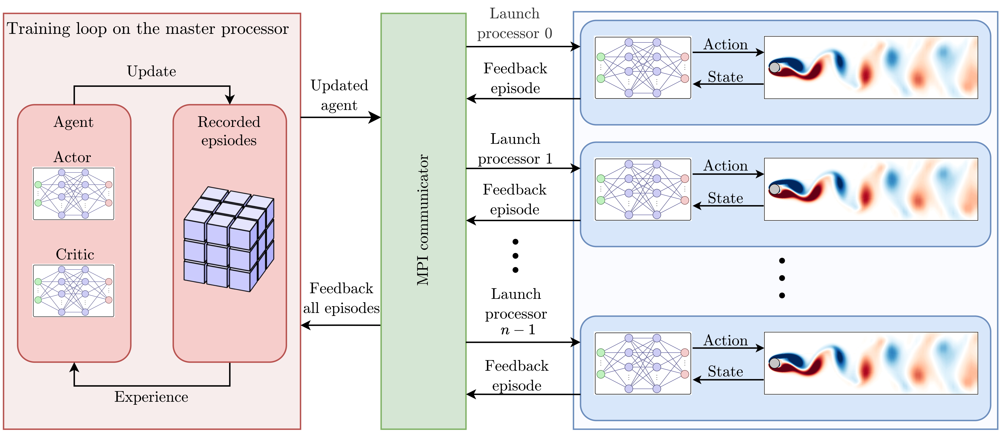

# TensorforceFoam

## General information
**TensorforceFoam** is a TensorFlow-based intrusive Deep Reinforcement Learning (DRL) framework for **OpenFOAM**. The **Tensorforce** package is utilized for the DRL computations. The term _intrusive_ refers to the direct integration of the DRL agent within the CFD environment. Such integration eliminates the need for any external information exchange during DRL episodes. The framework is parallelized using the message passing interface (MPI) for Python (**mpi4py**) to manage parallel environments for computationally intensive CFD cases through distributed computing. 

The schematic diagram of the framework's workflow is illustrated below. It shows how the training program operates across multiple processors, the role of the master processor in aggregating and updating data, and the communication between processors via MPI. More information about the theory, the developed codes, and the test cases are presented in the published article ([An efficient intrusive deep reinforcement learning framework for OpenFOAM
](https://link.springer.com/article/10.1007/s11012-024-01830-1)).



The source code for the OpenFOAM implementation of the DRL agent is found in the `OpenFOAM` folder, while the `training` folder contains the Python programs and the verification test cases. The library is tested and verified with the recent versions of [OpenFOAM](https://www.openfoam.com/), such as v2312 and 2406.


## How to install

To install the TensorforceFoam library, one needs to download the latest source code using git:
```bash
git clone https://github.com/salehisaeed/TensorforceFoam
```

The installation has to be done on both OpenFOAM and Python sides.


### Installation of the OpenFOAM side

The library is developed for the OpenCFD branch of OpenFOAM ([openfoam.com](https://www.openfoam.com/)). Therefore, a complete installation of OpenFOAM (preferably a recent version, such as OpenFOAM-v2312 or OpenFOAM-v2406, is required.).

Users are referred to [OpenFOAM installation guide](https://develop.openfoam.com/Development/openfoam/-/blob/master/doc/Build.md) for more information on installing OpenFOAM.


After installing OpenFOAMThen, in a terminal where OpenFOAM is sourced, run the `wmake` in the `OpenFOAM/src/DRLAgent` folder:
```bash
cd OpenFOAM/src/DRLAgent
wclean && wmake
```
The C++ compiler needs to be at least C++14 or preferably C++17. The compiler settings can be set inside the following file
```bash
$WM_PROJECT_DIR/wmake/rules/General/Gcc/c++
```
Inside this file, set `-std=c++17`. If you do not want to alternate the compiler settings globally, the same setting can be done via the `Make/option` file.


The **Tensorflow C API** needs to be installed. Download and extract the **Linux CPU only** version of TensorFlow for C. The library linked to the OpenFOAM compiled library to use the Tensorflow models within C++ codes. The address for the extracted library is required in the `option` file (`OpenFOAM/src/DRLAgent/Make/option`). For convenience, an environment variable can be defined for this address in the `.bashrc` as
```bash
export TF_LIBRARIES=/address/to/the/library/libtensorflow-cpu-linux-x86_64-2.8.0
```


The [**CppFlow**](https://github.com/serizba/cppflow) is also used here for loading and running Tensorflow models in C++. Download and install CppFlow from its corresponding github repository. However, CppFlow does not support boolean inputs to the Tensorflow models which is needed in the Tensorforce DRL agents. The boolean specifies whether the model is run in the deterministic (evaluating) or non-deterministic (for training) modes. Therefore, Small modifications are implemented to the original CppFlow library to make it compatible with boolean inputs. Only two files are modified which are found in the `cppflow`folder. The rest of the CppFlow files are the same as the original library.

Here again, an environment variable can be defined for the address of the cppflow library in the `.bashrc` for convenience:
```bash
export CPPFLOW_LIBRARIES=/address/to/the/library/cppflow
```


### Installation of the Python side

Create a new virtual environment and install **Tensorforce** and **mpi4py**. For more information on, the installation of these two packages, users are referred to the original libraries:
* Tensorforce documentation: [tensorforce.readthedocs.io/en/latest/](https://tensorforce.readthedocs.io/en/latest/)
* MPI for Python documentation: [mpi4py.readthedocs.io/en/stable/](https://mpi4py.readthedocs.io/en/stable/)


# How to use 
The vortex shedding behind a 2D cylinder case study, presented in Section 3.1 of the ([published article](https://link.springer.com/article/10.1007/s11012-024-01830-1)), is presented here in the `training` folder. To run the tutorial case and train a model from scratch, simply enter the `training` folder and run
 ```bash
mpirun -np 5 python3 training_mpi.py &> log.training
```
Here, five parallel CFD environments are run, each of which uses CFD parallel processing. The number of cores for each parallel CFD is specified inside `system/decomposeParDict` file.

The 3D cylinder case study, presented in Section 3.2 of the ([published article](https://link.springer.com/article/10.1007/s11012-024-01830-1)) will also be added soon.


# How to cite
If you use TensorforceFoam, kindly cite the original article of this framework
```
@article{Salehi2024Meccanica,
    author = {Saeed Salehi},
    title = "{An efficient intrusive deep reinforcement learning framework for OpenFOAM}",
    journal = {Meccanica},
    year = {2024},
    doi = {10.1007/s11012-024-01830-1}
    }   
```


<!---
## Reference
[1]. S. Salehi, An efficient intrusive deep reinforcement learning framework for OpenFOAM, Meccanica (2024), [doi.org/10.1007/s11012-024-01830-1](https://doi.org/10.1007/s11012-024-01830-1)
-->